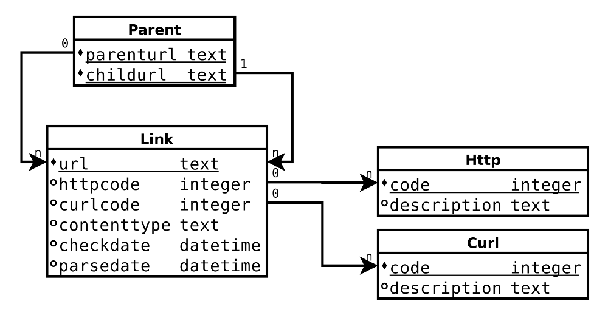

DeadLink
========

DeadLink is a dead link checker written in Haskell.

Building deadlink
-----------------

DeadLink has been written in Haskell and is compiled with GHC 7.10. It is
meant to be run under Linux.

It requires Curl and SQLite3 development libraries.

To build `deadlink`:

    cabal build

The `deadlink` executable will have been created in `./dist/build/deadlink`.

Usage
-----

First `deadlink` needs an SQLite3 database.

To create a database named `deadlink.db`:

    deadlink create deadlink.db

This script creates an empty SQLite3 database structured for `deadlink`. The
use of a SQLite3 database has benefits:

- `deadlink` can be stopped and resumed at any time without losing links,
- the database can be queried with standard SQL statements,
- the database consists of one file which can be copied or saved for later use.

Once the database has been created, you can run `deadlink`:

    deadlink crawl <dbname> <base URL>

For example:

    deadlink crawl example.com.db http://www.example.com/

Everytime `deadlink` needs to be resumed, it requires the same base URL to
be specified.

Querying the database
---------------------

The `deadlink` database is a SQLite3 database. Querying it is as simple as
running:

    sqlite3 deadlink.db

Here’s the database schema:

Query examples:

    -- Get number of links in the database
    SELECT COUNT(*)
    FROM   link;

    -- Get number of links that have been checked or parsed
    SELECT COUNT(*)
    FROM   link
    WHERE  checkdate IS NOT NULL
    OR     parsedate IS NOT NULL;

    -- Get number of links which returned a 404 HTTP code
    SELECT COUNT(*)
    FROM   link
    WHERE  httpcode = 404;

    -- Get dead links and the pages on which they have been found
    SELECT url, parenturl
    FROM   link, parent
    WHERE  httpcode = 404
    AND    childurl = url;

The `code` is prepopulated with HTTP codes and their descriptions ready to be
used in your queries.

The `deadlinkstat.bash` script contains more examples of how to query the
database.

Its output looks like:

    Statistics for http://www.example.com/

    - Links: 24
    - External links: 10
    - HTML pages: 12
    - Checked links: 24
    - Most used dead links:
      - http://www.example.org/
    - HTTP codes:
      - 200 OK: 21
      - 301 Moved Permanently: 1
      - 302 Moved Temporarily: 2
    - Content types:
      - [unknown]: 4
      - application/javascript: 1
      - application/pdf: 4
      - image/x-icon: 1
      - text/css: 2
      - text/html: 9
      - text/html; charset=ISO-8859-1: 1
      - text/html; charset=UTF-8: 1
      - text/html; charset=utf-8: 1

Notes
-----

To avoid infinite recursion, `deadlink` is limited to 15 iterations.

`deadlink` will take a lot of time for large sites. This is because `deadlink`
does only one HTTP query at a time in order to be light on web servers.

`deadlink` user agent is "Zigazou's DeadLink finder".

`deadlink` uses cURL for every HTTP related action. Therefore, it supports
proxy settings via the `http_proxy` and `https_proxy` environment variables.

Writes to the database are done after 50 links checked/parsed. If `deadlink`
is stopped, there is potentially a maximum of 50 links that will need to be
checked again.

`deadlink` will check every links found on HTML pages but only HTML pages
belonging to the base URL will be parsed.

Everytime `deadlink` needs to be resumed, it requires the same base URL to
be specified.

Opening a Deadlink database while `deadlink` is working, even if it’s only for
reading, can avoid `deadlink` to update it.

Reserved top-level and second-level domain name like `example.com` or
`localhost` are considered dead links.

Date and time of checking are recorded as UTC.
